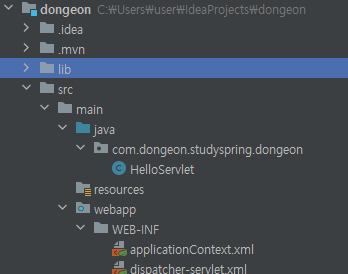
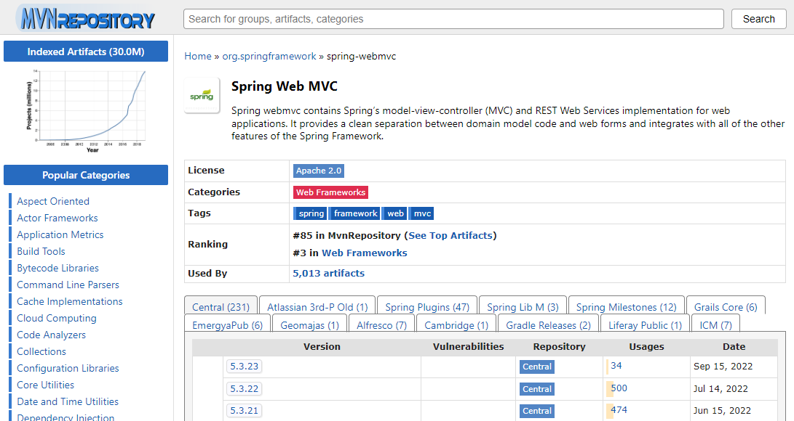
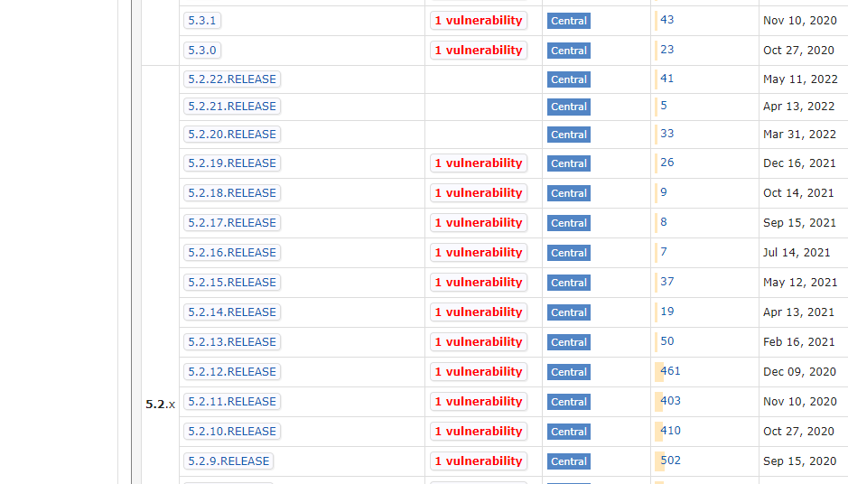
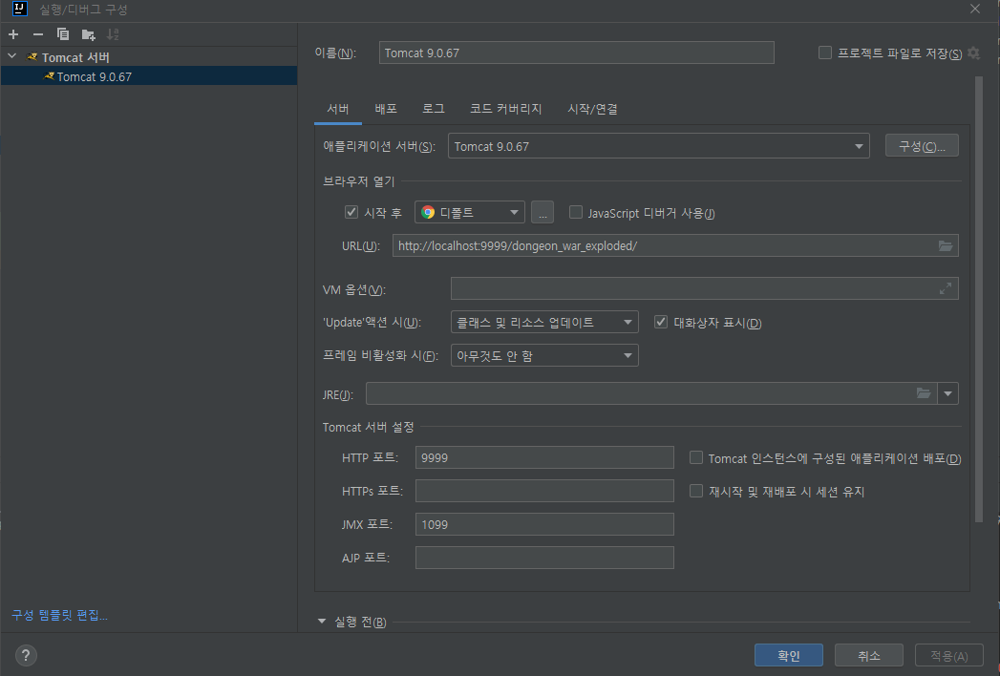

# Intellij에서 maven으로 설정하기
Intellij + Maven + Tomcat + Spring Legacy
- - -
Intellij Community(무료) 버전은 스프링 프레임워크를 지원하지않아서  
직접 설정하고 사용해야 합니다.  

Community로 스프링 레거시 설정을 하고 톰캣으로 실행하는 과정이 생각보다 잘 되지않아서 Ultimate(유료) 30일 체험으로 진행하였습니다.  


<!--
[IntelliJ + Spring Legacy Project + Maven + Tomcat](https://velog.io/@wooriworld/IntelliJ%EC%97%90%EC%84%9C-Spring-Legacy-Project-%EC%83%9D%EC%84%B1%ED%95%98%EA%B8%B0-Maven-Tomcat)

[intellij 학생 인증](https://goddaehee.tistory.com/215)
-->

## 새 프로젝트 생성  
인텔리제이 메뉴 창에서 **\[파일\] - \[새로 만들기\] - \[프로젝트\]** 를 선택해서 새 프로젝트를 생성합니다.  
- Community 버전  
  

- Ultimate 버전  
  

Ultimate 버전에서  
1. 템플릿 - 웹 애플리케이션
2. 애플리케이션 서버 - Tomcat 설정  
    새로 만들기에서 설치된 톰캣이 있는 경로를 설정해주었습니다.  
3. 이름, 그룹명을 제가 원하는 이름으로 설정했습니다.  
4. JDK는 Spring 에서 8을 최신버전으로 쓰고 있다기에 1.8을 사용했습니다. (8과 1.8은 같다고 봐도 무방)  
5. 다음(N)

- 프로젝트 설정  
  
Maven의 pom.xml 파일로 직접 설정까지 해볼 예정이기 때문에 종속성으로 Servlet만 추가해주었습니다.  

가장 위의 버전의 경우 Java EE 8, Jakarta EE 9 가 있습니다.  
Jakarta EE가 Java EE가 업그레이드 되면서 나온 이름이라 같다고 봐도 된다기에 Jakarta EE 로 설정했습니다.  
대부분의 구글 예제들은 Java EE 를 사용하고 있는 것 같았습니다.  

이렇게 설정을 마치고 생성(C)를 하였습니다.  
- - -
## 초기 상태  

생성을 마치고 아래와 같은 상태로 프로젝트가 생성되었습니다.  
- 프로젝트 초기 상태  
  

이제 생성된 프로젝트에 Spring MVC를 적용시키겠습니다.  
프로젝트 이름을 우클릭하고 "프레임워크 지원 추가"를 선택합니다.  

아래와 같은 선택창이 나오는데 Spring MVC에서 다운로드를 선택하고 확인을 해줍니다. 
- 프레임워크 지원 추가  
  

하지만 저는 위에서 프로젝트 생성할 때 말했듯, pom.xml 파일로 직접 설정까지 해볼 예정이기 때문에 프로젝트에 생성된 lib 파일은 삭제하도록 하겠습니다.  

- 선택된 디렉토리 삭제  
  

그럼에도 프레임워크 지원 추가를 한 이유는 지원 추가를 하면서 생긴 새로운 파일들이 존재하기 때문입니다.  
```/main/webapp/WEB-INF/```경로에 ```applicationContext.xml```과 ```dispatcher-servlet.xml```파일이 생긴 것을 확인 할 수 있습니다.  
인텔리제이 Community 버전을 쓰면서 다른 추가 파일이나 설정을 다루는 법을 모르는 상태였기 때문에 Ultimate 버전의 도움을 받았습니다.  

이제 ```pom.xml```을 통해 spring 설정을 하도록 하겠습니다.  
```pom.xml```에 빨간 상자 부분을 각각 추가해주었습니다.  
- ```pom.xml```  
  

properties 에 스프링 프레임워크의 버전을,  
dependencies 에 의존성을 spring webmvc의 의존성을 설정해주었습니다.  

- 기존과 다른 버전  

기존에 인텔리제이에서 Default로 스프링 프레임워크 버전은 5.2.3.RELEASE 버전이었습니다.  

저는 새로운 설정을 해보고 싶었기 때문에 현재 가장 최신 릴리즈 버전을 사용했습니다.  

최신 버전은 [링크](https://mvnrepository.com/artifact/org.springframework/spring-webmvc)에서 참고하였습니다.  

- 메이븐 페이지에서 Spring Web MVC 검색  


- 아래로 스크롤을 내렸을 때 보이는 릴리즈 버전 중 최신 버전  
  
    - 릴리즈버전이 아닌 최신 버전은 혹시 모를 오류가 있을 수 있어 사용하지 않았습니다.  

다시 돌아와서 ```pom.xml```의 설정을 마쳤다면 우측 상단의 maven 버튼을 눌러줍니다.  

  

적용을 확인하기 위해 인텔리제이 우측의 \[Maven\]을 클릭하고 종속성을 확인했습니다.  
만약 적용이 안된 것 같거나 위에서 버튼을 누르지 못했다면 여기서 새로고침을 누를 수 있습니다.  
- 종속성 확인  
  

설정했던 5.2.22 릴리즈 버전을 확인했습니다.  
- - - 
인텔리제이에서 \[파일\] - \[프로젝트 구조\](Ctrl + Alt + Shift + S)에서 라이브러리 창을 선택합니다.  

해당 창에서 빨간 줄로 표시된, 위에서 삭제했었던 5.2.3 RELEASE 버전 2개가 있는 것을 확인 할 수 있습니다.  
위에 있는 \- 버튼으로 해당 라이브러리 두개를 삭제하였습니다.  

## 컨트롤러 생성  
이제 간단한 컨트롤러를 하나 생성해주도록 하겠습니다.  
해당 경로에 컨트롤러 패키지와 테스트를 위한 컨트롤러 하나를 만들었습니다.  

```/src/main/java/com/dongeon/studyspring/dongeon/controller/TestController.java```  
  

```java
import org.springframework.stereotype.Controller;
import org.springframework.web.bind.annotation.RequestMapping;

@Controller
public class TestController {
    @RequestMapping("/")
    public String test() {
        return "index";
    }
}
```
배치파일 ```web.xml```도 수정하겠습니다.  

```/src/main/webapp/WEB-INF/web.xml```  
```xml
<?xml version="1.0" encoding="UTF-8"?>
<web-app xmlns="https://jakarta.ee/xml/ns/jakartaee"
         xmlns:xsi="http://www.w3.org/2001/XMLSchema-instance"
         xsi:schemaLocation="https://jakarta.ee/xml/ns/jakartaee https://jakarta.ee/xml/ns/jakartaee/web-app_5_0.xsd"
         version="5.0">
    <context-param>
        <param-name>contextConfigLocation</param-name>
        <param-value>/WEB-INF/applicationContext.xml</param-value>
    </context-param>
    <listener>
        <listener-class>org.springframework.web.context.ContextLoaderListener</listener-class>
    </listener>
    <servlet>
        <servlet-name>dispatcher</servlet-name>
        <servlet-class>org.springframework.web.servlet.DispatcherServlet</servlet-class>
        <load-on-startup>1</load-on-startup>
    </servlet>
    <servlet-mapping>
        <servlet-name>dispatcher</servlet-name>
        <url-pattern>/</url-pattern> <!-- *.form → / -->
    </servlet-mapping>
</web-app>
```
초기설정에서 \<servlet-mapping\>안의 \<url-pattern\> 에서 ```*.form``` 으로 되어있는 부분을 ```/```로 바꾸었습니다.  

마지막으로  
Spring 설정할 때 생겼었던 ```dispatcher-servlet.xml``` 내용도 수정하겠습니다.  

```/src/main/webapp/WEB-INF/dispatcher-servlet.xml```  
```xml
<?xml version="1.0" encoding="UTF-8"?>
<beans xmlns="http://www.springframework.org/schema/beans"
       xmlns:xsi="http://www.w3.org/2001/XMLSchema-instance"
       xmlns:context="http://www.springframework.org/schema/context"
       xmlns:mvc="http://www.springframework.org/schema/mvc"
       xsi:schemaLocation="http://www.springframework.org/schema/beans http://www.springframework.org/schema/beans/spring-beans.xsd http://www.springframework.org/schema/context https://www.springframework.org/schema/context/spring-context.xsd http://www.springframework.org/schema/mvc https://www.springframework.org/schema/mvc/spring-mvc.xsd">

    <mvc:annotation-driven />
    <context:component-scan base-package="com.dongeon.studyspring.dongeon.controller" />

    <bean class="org.springframework.web.servlet.view.InternalResourceViewResolver">
        <property name="prefix" value="/WEB-INF/views/" />
        <property name="suffix" value=".jsp" />
    </bean>
</beans>
```
먼저, \<mvc:annotation-driven \/\> 은  
```@Controller```를 Annotation으로 작성했기 때문에 태그를 작성했습니다.  

다음은 \<context:component-scan base-package=""\> 부분의 기본패키지 경로를 controller 경로로 잡았다는 뜻입니다.  

마지막으로 bean property 설정은 파일명을 작성하면 /WEB-INF/views/ 경로에서 파일명.jsp가 열린다는 뜻입니다.  

## Tomcat Setting  
인텔리제이에서 \[실행\] - \[구성 편집\] 에서 톰캣 설정을 할 수 있습니다.  

  
좌측 상단에 + 에서 \[Tomcat 서버\] - \[로컬\]을 선택해줍니다.  

이후 애플리케이션 서버는 설치한 톰캣 경로 설정으로 구성해 주고 확인을 누르면 톰캣 설정을 할 수 있습니다.  

저는 기본 설정인 8080포트가 아닌 9999포트를 사용하기 위해 아래의 HTTP 포트 부분을 9999 설정으로 바꿔주었습니다.  

브라우저 열기 시작 후 부분에 체크가 되어 있기 때문에 서버가 실행 된 뒤에 자동으로 디폴트 URL 브라우저가 열리게 됩니다.  

이제 톰캣을 실행 시켜보겠습니다.  

- 톰캣 실행  
  

우측 상단의 실행 버튼을 통해 톰캣을 실행하면 정상적으로 실행이 됩니다.  


## 참고 자료  
[https://code-boki.tistory.com/20](https://code-boki.tistory.com/20)  