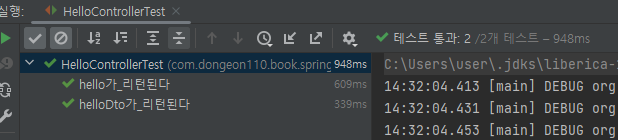

# 롬복으로 리팩토링  
이제 테스트 코드가 작동하기 때문에 큰 프로젝트더라도 테스트 코드만 돌려보면 정상작동하는지 확인 할 수 있습니다.  

기존의 web패키지에서 dto 패키지를 추가하겠습니다.  
그리고 HelloResponseDto를 생성합니다.  

```HelloResponseDto.java```
```java
import lombok.Getter;
import lombok.RequiredArgsConstructor;

@Getter // 1.
@RequiredArgsConstructor // 2.
public class HelloResponseDto {
    private final String name;
    private final int amount; 
}
```
## 코드 설명  
1. @Getter  
- 선언된 모든 필드의 get 메서드를 생성해 줍니다.  

2. @RequiredArgsConstructor  
- 선언된 모든 final 필드가 포함된 생성자를 생성해 줍니다.  
- final이 없는 필드는 생성자에 포함되지 않습니다.  

- - -
이제 잘 작동하는지 확인하기 위해 테스트 코드를 작성해보겠습니다.  

```HelloResponseDtoTest.java```
```java
import org.junit.Test;
import static org.assertj.core.api.Assertions.assertThat;

public class HelloResponseDtoTest {

    @Test
    public void 롬복_기능_테스트() {
        // given
        String name = "test";
        int amount = 1000;

        // when
        HelloResponseDto dto = new HelloResponseDto(name, amount);

        // then
        assertThat(dto.getName()).isEqualTo(name); // 1, 2.
        assertThat(dto.getAmount()).isEqualTo(amount);
    }
}
```
## 코드 설명  
1. assertThat  
- assertj라는 테스트 검증 라이브러리의 검증 메서드입니다.  
- 검증하고 싶은 대상을 메소드 인자로 받습니다.  
- 메소드 체이닝이 지원되어 isEqualTo와 같이 메소드를 이어서 사용할 수 있습니다.  

2. isEqualTo  
- assertj의 동등 비교 메소드입니다.  
- assertThat에 있는 값과 isEqualTo의 값을 비교해서 같을 때만 성공입니다.  

### Junit의 기본 assertThat 대신 assertj의 assertThat 사용 이유  
- Junit과 비교하여 assertj의 장점  
1. CoreMatchers와 달리 추가적으로 라이브러리가 필요하지 않음.  
    - Junit의 assertThat을 쓰게 되면 is()와 같이 CoreMatchers 라이브러리가 필요합니다.  
2. 자동완성이 좀 더 확실하게 지원됩니다.  
    - IDE에서는 CoreMatchers와 같은 Matcher 라이브러리의 자동완성 지원이 약합니다.  

assertj 가 Junit의 assertThat보다 편리한 이유  
[백기선님 유튜브](http://bit.ly/30vm9Lg) 참고  

테스트 실패원인과 어떻게 해결하는지를 자세히 기록한 문서를 참고하면 좋음  
[링크](http://bit.ly/382Q7d7)  
- - -

# 코드 추가  
```HelloController.java```에 다음과 같은 코드 추가  
```java
@GetMapping("/hello/dto")
public HelloResponseDto helloDto(@RequestParam("name") String name, /* 1. */
                                 @RequestParam("amount") int amount) {
    return new HelloResponseDto(name, amount);
}
```
## 코드 설명  
1. @RequestParam  
- 외부에서 API로 넘긴 파라미터를 가져오는 어노테이션  
- 여기서는 외부에서 name(@RequestParam("name")) 이란 이름으로 넘긴 파라미터를 메소드 파라미터 name(String name)에 저장하게 됩니다.  

name과 amount는 API를 호출하는 곳에서 넘겨준 값들입니다.  
추가된 API를 테스트코드에 추가하겠습니다.
- - -
```HelloControllerTest.java```
```java
import org.junit.Test;
import org.junit.runner.RunWith;
import org.springframework.beans.factory.annotation.Autowired;
import org.springframework.boot.test.autoconfigure.web.servlet.WebMvcTest;
import org.springframework.test.context.junit4.SpringRunner;
import org.springframework.test.web.servlet.MockMvc;

import static org.hamcrest.Matchers.is;
import static org.springframework.test.web.servlet.request.MockMvcRequestBuilders.get;
import static org.springframework.test.web.servlet.result.MockMvcResultMatchers.content;
import static org.springframework.test.web.servlet.result.MockMvcResultMatchers.jsonPath;
import static org.springframework.test.web.servlet.result.MockMvcResultMatchers.status;

@RunWith(SpringRunner.class)
@WebMvcTest(controllers = HelloController.class)
public class HelloControllerTest {

    @Autowired
    private MockMvc mvc;

    @Test
    public void hello가_리턴된다() throws Exception {
        String hello = "hello";

        mvc.perform(get("/hello"))
                .andExpect(status().isOk())
                .andExpect(content().string(hello)); 
    }

    @Test
    public void helloDto가_리턴된다() throws Exception {
        String name = "hello";
        int amount = 1000;

        mvc.perform(
                get("/hello/dto")
                        .param("name", name)  // 1. 
                        .param("amount", String.valueOf(amount)))
                .andExpect(status().isOk())
                .andExpect(jsonPath("$.name", is(name)))  // 2.
                .andExpect(jsonPath("$.amount", is(amount)));
    }
}
```

## 코드 설명  
1. param  
- API 테스트할 때 사용될 요청 파라미터를 설정합니다.  
- 값은 String만 허용됩니다.  
2. jsonPath  
- JSON 응답값을 필드별로 검증할 수 있는 메서드 입니다.  
- \$를 기준으로 필드명을 명시합니다.  
- 여기서는 name과 amount를 검증하니 \$.name, \$.amount로 검증합니다.  

## 테스트 결과  
  

