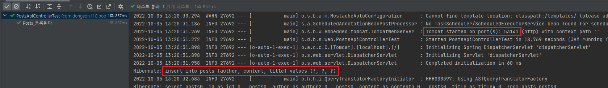
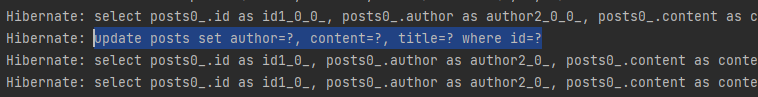
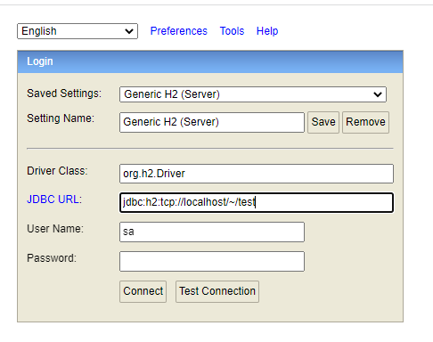
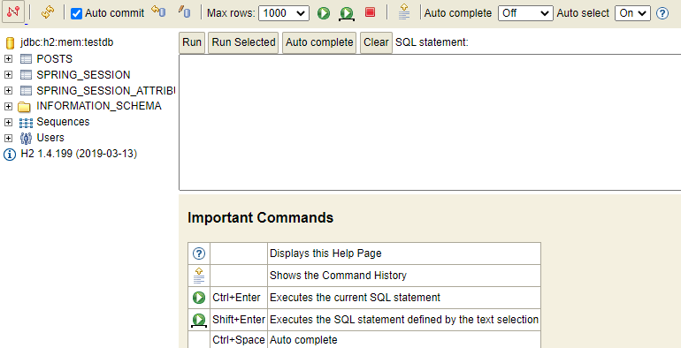
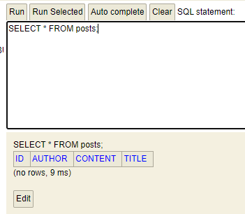
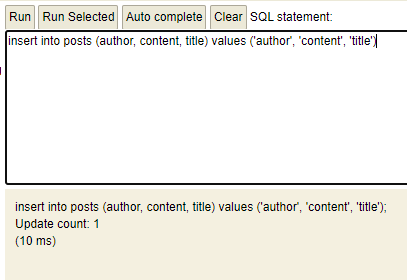
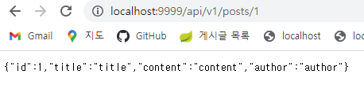

# 등록/수정/조회 API 만들기  
본격적으로 API를 만들어 보겠습니다.  

## API를 만들기 위해 필요한 것  
API를 만들기 위해 총 3개의 클래스가 필요합니다.  
1. Request 데이터를 받을 Dto  
2. API 요청을 받을 Controller  
3. 트랜잭션, 도메인 기능 간의 순서를 보장하는 Service  

여기서 주로 오해하는 것이, Service에서 비즈니스 로직을 처리해야 한다는 것입니다.  
하지만, Service는 **트랜잭션, 도메인 간 순서 보장**의 역할만 합니다.  
- - -
그렇다면 비즈니스 로직은 누가 처리하냐? 라는 의문점이 생깁니다.  

다음은 Spring 웹 계층을 보여주는 그림입니다.  


간단히 각 영역을 소개하자면 다음과 같습니다.  
- Web Layer
    - 흔히 사용하는 컨트롤러(@Controller)와 JSP/Freemaker 등의 뷰 템플릿 영역입니다.  
    - 이외에도 필터(@Filter), 인터셉터, 컨트롤러 어드바이스(@ControllerAdvice) 등 외부 요청과 응답에 대한 전반적인 영역을 이야기합니다.  
    - exception handler(@ExceptionHandler)는 Controller계층에서 발생하는 에러를 잡아 메서드로 처리해주는 기능입니다. (Controller Advice에서 ExceptionHandler를 사용하여 에러를 잡을 수도 있습니다.)
- Service Layer  
    - @Service에 사용되는 서비스 영역입니다.  
    - 일반적으로 Controller와 Dao의 중간 영역에서 사용됩니다.  
    - @Transactional이 사용되어야 하는 영역이기도 합니다.  
- Repository Layer  
    - Database와 같이 데이터 저장소에 접근하는 영역입니다.  
    - 기존에 개발할때 DAO 영역으로 이해하면 쉬울 것입니다. (Servlet으로 구현했을 때 DAO 영역으로 이해했습니다.)  
- Dto(Data Transfer Object)
    - Dto는 **계층 간에 데이터 교환을 위한 객체**를 이야기하며 Dtos는 이들의 영역을 이야기 합니다.  
    - 예컨대, 뷰 템플릿 엔진에서 사용될 객체나, Repository Layer에서 결과로 넘겨준 객체 등이 이들을 이야기합니다.  
- Domain Model  
    - 도메인이라 불리는 개발 대상을 모든 사람이 동일한 관점에서 이해할 수 있고 공유 할 수 있도록 단순화시킨 것을 도메인 모델이라고 합니다.  
    - 이를테면 택시 앱이라고 하면 배차, 탑승, 요금 등이 모두 도메인이 될 수 있습니다.  
    - @Entity를 사용해보신 분들은 @Entity가 사용된 영역 역시 도메인 모델이라고 이해해주시면 됩니다.  
    - 다만, 무조건 데이터베이스의 테이블과 관계가 있어야만 하는 것은 아닙니다.  
    - VO처럼 값 객체들도 이 영역에 해당하기 때문입니다.  

이 5가지 레이어에서 비즈니스 처리를 담당하는 곳은 Domain입니다.  

기존에 서비스로 처리하던 방식을 **트랜잭션 스크립트**라고 합니다.  
주문 취소 로직을 작성한다면 다음과 같습니다.  
- - -
```슈도 코드```(의사코드, pseudocode, 프로그램을 작성할 때 각 모듈이 작동하는 논리를 표현하기 위한 언어. 특정 프로그래밍 언어의 문법에 따라 쓰인것이 아니라, 일반적인 언어로 코드를 흉내 내어 알고리즘을 써놓은 코드)
```java
@Transactional
public Order cancelOrder(int orderId) {
    1) 데이터베이스로부터 주문정보(Orders), 결제정보(Billing), 배송정보(Delivery) 조회
    2) 배송 취소를 해야 하는지 확인
    3) if(배송 중이라면) {
        배송 취소로 변경
    }
    4) 각 테이블에 취소 상태 Update
}
```

```실제 코드```  
```java
@Transactional
public Order cancelOrder(int orderId) {
    // 1)
    OrderDto order = ordersDao.selectOrders(orderId);
    BillingDto billing = billingDao.selectBilling(orderId);
    DeliveryDto delivery = deliveryDao.selectDelivery(orderId);

    // 2)
    String deliveryStatus = delivery.getStatus();
    
    // 3)
    if("IN_PROGRESS".equals(deliveryStatus)) {
        delivery.setStatus("CANCEL");
        deliveryDao.update(delivery);
    }

    // 4)
    order.setStatus("CANCEL");
    orderDao.update(order);

    billing.setStatus("CANCEL");
    deliveryDao.update(billing);

    return order;
}
```
모든 로직이 **서비스 클래스 내부에서 처리됩니다**.  
그러다 보니 **서비스 계층이 무의미**하며, **객체란 단순히 데이터 덩어리** 역할만 하게됩니다.  
반면 도메인 모델에서 처리 할 경우 다음과 같은 코드가 될 수 있습니다.  
- - -
**도메인 모델에서 처리할 경우**  
```java
@Transactional
public Order cancelOrder(int orderId) {

    // 1)
    Orders order = ordersRepositorys.findById(orderId);
    Billing billing = billingRepository.findByOrderId(orderId);
    Delivery delivery = deliveryRepository.findByOrderId(orderId);

    // 2-3)
    delivery.cancel();

    // 4)
    order.cancel();
    billing.cancel();

    return order;
}
```
order, billing, delivery가 각자 본인의 취소 이벤트 처리를 하며, 서비스 메서드는 트랜잭션과 도메인간의 순서만 보장해 줍니다.  
여기서도 계속 도메인 모델을 다루고 코드를 작성하겠습니다.  
- - -
그럼 등록, 수정, 삭제 기능을 만들어 보겠습니다.  
1. ```PostApiController``` 를 ```web``` 패키지에,  
2. ```PostsService``` 를 ```service.posts``` 패키지에,  
3. ```PostSaveRequestDto``` 를 ```web.dto``` 패키지에 생성합니다.  


### ```PostsApiController```  
경로: ```src/main/java/com/dongeon110/book/springboot/web/PostApiController.java```
```java
import com.dongeon110.book.springboot.service.PostsService;
import com.dongeon110.book.springboot.web.dto.PostsSaveRequestDto;
import lombok.RequiredArgsConstructor;
import org.springframework.web.bind.annotation.PostMapping;
import org.springframework.web.bind.annotation.RequestBody;
import org.springframework.web.bind.annotation.RestController;

@RequiredArgsConstructor
@RestController
public class PostsApiController {
    private final PostsService postsService;

    @PostMapping("/api/v1/posts")
    public Long save(@RequestBody PostsSaveRequestDto requestDto) {
        return postsService.save(requestDto);
    }
}
```

### ```PostsService```
경로: ```src/main/java/com/dongeon110/book/springboot/service/PostsService.java```
```java
import com.dongeon110.book.springboot.domain.posts.PostsRepository;
import com.dongeon110.book.springboot.web.dto.PostsSaveRequestDto;
import lombok.RequiredArgsConstructor;
import org.springframework.stereotype.Service;
import org.springframework.transaction.annotation.Transactional;

@RequiredArgsConstructor
@Service
public class PostsService {
    private final PostsRepository postsRepository;

    @Transactional
    public Long save(PostsSaveRequestDto requestDto) {
        return postsRepository.save(requestDto.toEntity()).getId();
    }
}

```

스프링을 어느 정도 써보셨다면 Controller와 Service에서 ```@Autowired```가 없는 것이 어색하게 느껴집니다.  
스프링에서는 Bean을 주입하는 방식이 다음과 같습니다.

* 스프링에서 Bean 주입하는 방식
1. ```@Autowired```
2. setter
3. 생성자  

여기서 가장 권장하는 방식은 **생성자로 주입**받는 방식입니다. (```@Autowired```는 권장하지 않음)  
즉, 생성자로 Bean 객체를 받도록 하면, ```@Autowired```와 동일한 효과를 볼 수 있다는 것입니다.  

여기서 생성자는 ```@RequiredArgsConstructor```에서 해결해 줍니다.  
**final이 선언된 모든 필드**를 인자값으로 하는 생성자를 롬복의 ```@RequiredArgsConstructor```가 대신 생성해 준 것입니다.  

생성자를 직접 쓰지 않고 롬복 어노테이션을 사용한 이유는 간단합니다.  
해당 클래스의 의존성관계가 변경될 때마다 생성자 코드를 계속해서 수정하는 번거로움을 해결하기 위함입니다.  
( 롬복 어노테이션이 있으면 해당 컨트롤러에 새로운 서비스를 추가하거나, 기존 컴포넌트를 제거하는 등의 상황이 발생해도 생성자 코드는 젼혀 손대지 않아도 됩니다. )  

### ```PostsSaveRequestDto```
경로: ```src/main/java/com/dongeon110/book/springboot/web/dto/PostsSaveRequestDto```  
```java
import com.dongeon110.book.springboot.domain.posts.Posts;
import lombok.Builder;
import lombok.Getter;
import lombok.NoArgsConstructor;

@Getter
@NoArgsConstructor
public class PostsSaveRequestDto {
    private String title;
    private String content;
    private String author;

    @Builder
    public PostsSaveRequestDto(String title, String content, String author) {
        this.title = title;
        this.content = content;
        this.author = author;
    }

    public Posts toEntity() {
        return Posts.builder()
                .title(title)
                .content(content)
                .author(author)
                .build();
    }
}
```

Entity 클래스와 거의 유사한 형태임에도 Dto 클래스를 추가로 생성했습니다.  
하지만, 절대로 **Entity 클래스를 Request/Response 클래스로 사용해서는 안됩니다.**  

Entity 클래스는 **데이터베이스와 맞닿은 핵심 클래스**입니다.  
Entity 클래스를 기준으로 테이블이 생성되고, 스키마가 변경됩니다.  
화면변경은 아주 사소한 기능 변경인데, 이를 위해 Entity 클래스를 변경하는 것은 너무 큰 변경입니다.  

수많은 서비스 클래스나 비즈니스 로직들이 Entity 클래스를 기준으로 동작합니다.  
Entity 클래스가 변경되면 여러 클래스에 영향을 끼치지만, Request와 Response용 Dto는 View를 위한 클래스라 정말 자주 변경이 필요합니다.  

View Layer와 DB Layer의 역할 분리를 철저하게 하는 게 좋습니다.  
실제로 Controller에서 결과값으로 여러 테이블을 조인해서 줘야 할 경우가 빈번하므로, Entity 클래스 만으로 표현하기가 어려운 경우가 많습니다.  

꼭 Entity 클래스와 Controller에서 쓸 Dto는 분리해서 사용해야 합니다.  

이제 테스트 패키지 중 web 패키지의 ```PostsApiControllerTest```를 생성합니다.  

### ```PostApiControllerTest``` 등록기능 테스트  
경로: ```src/test/java/com/dongeon110/book/springboot/web/PostsApiControllerTest.java```  

```java
import com.dongeon110.book.springboot.domain.posts.Posts;
import com.dongeon110.book.springboot.domain.posts.PostsRepository;
import com.dongeon110.book.springboot.web.dto.PostsSaveRequestDto;
import org.junit.After;
import org.junit.Test;
import org.junit.runner.RunWith;
import org.springframework.beans.factory.annotation.Autowired;
import org.springframework.boot.test.context.SpringBootTest;
import org.springframework.boot.test.web.client.TestRestTemplate;
import org.springframework.boot.web.server.LocalServerPort;
import org.springframework.http.HttpStatus;
import org.springframework.http.ResponseEntity;
import org.springframework.test.context.junit4.SpringRunner;

import java.util.List;

import static org.assertj.core.api.Assertions.assertThat;

@RunWith(SpringRunner.class)
@SpringBootTest(webEnvironment = SpringBootTest.WebEnvironment.RANDOM_PORT)
public class PostsApiControllerTest {

    @LocalServerPort
    private int port;

    @Autowired
    private TestRestTemplate restTemplate;

    @Autowired
    private PostsRepository postsRepository;

    @After
    public void tearDown() throws Exception {
        postsRepository.deleteAll();
    }

    @Test
    public void Posts_등록된다() throws Exception {
        // given
        String title = "title";
        String content = "content";
        PostsSaveRequestDto requestDto = PostsSaveRequestDto.builder()
                .title(title)
                .content(content)
                .author("author")
                .build();

        String url = "http://localhost:" + port + "/api/v1/posts";

        // when
        ResponseEntity<Long> responseEntity = restTemplate.postForEntity(url, requestDto, Long.class);

        // then
        assertThat(responseEntity.getStatusCode()).isEqualTo(HttpStatus.OK);
        assertThat(responseEntity.getBody()).isGreaterThan(0L);

        List<Posts> all = postsRepository.findAll();
        assertThat(all.get(0).getTitle()).isEqualTo(title);
        assertThat(all.get(0).getContent()).isEqualTo(content);
    }
}
```
- 테스트 결과  

  
테스트는 정상적으로 통과가 되었습니다.  

```WebEnvironment.RANDOM_PORT```로 인한 랜덤 포트 실행과  
insert 쿼리가 실행된 것을 아래 로그에서 모두 확인 할 수 있었습니다. 

랜덤 포트 실행
```log
Tomcat started on ports(s): 53141
```
insert 쿼리
```log
Hibernate: insert into posts (author, content, title) value (?, ?, ?)
```

이렇게 등록 기능이 완성되었습니다.  


## 수정 / 조회 기능  
- ```PostsApiController```  
```java
@RequiredArgsConstructor
@RestController
public class PostsApiController {
    ...

    @PutMapping("/api/v1/posts/{id}")
    public Long update(@PathVariable Long id, @RequestBody PostsUpdateRequestDto requestDto) {
        return postsService.update(id, requestDto);
    }

    @GetMapping("/api/v1/posts/{id}")
    public PostsResponseDto findById (@PathVariable Long id) {
        return postsService.findById(id);
    }
}
```

- ```PostsResponseDto```  
경로: ```src/main/java/com/dongeon110/book/springboot/web/dto/PostResponseDto.java```  
```java
@Getter
public class PostsResponseDto {
    private Long id;
    private String title;
    private String content;
    private String author;

    public PostsResponseDto(Posts entity) {
        this.id = entity.getId();
        this.title = entity.getTitle();
        this.content = entity.getContent();
        this.author = entity.getAuthor();
    }
}
```

PostsResponseDto는 Entity의 필드 중 일부만 사용하므로 생성자로 Entity를 받아 필드에 값을 넣습니다.  
굳이 모든 필드를 가진 생성자가 필요하진 않으므로 Dto는 Entity를 받아 처리합니다.  

- PostsUpdateRequestDto
```java
@Getter
@NoArgsConstructor
public class PostsUpdateRequestDto {
    private String title;
    private String content;

    @Builder
    public PostsUpdateRequestDto(String title, String content) {
        this.title = title;
        this.content = content;
    }
}
```

- Posts
```java
public class Posts {
    ...
    public void update(String title, String content) {
        this.title = title;
        this.content = content;
    }
}
```

- PostsService  
```java
@RequiredArgsConstructor
@Service
public class PostsService {
    ...
    @Transactional
    public Long update(Long id, PostsUpdateRequestDto requestDto) {
        Posts posts = postsRepository.findById(id)
                .orElseThrow(() -> new IllegalArgumentException("해당 게시글이 없습니다. id=" + id));
        posts.update(requestDto.getTitle(), requestDto.getContent());

        return id;
    }

    public PostsResponseDto findById(Long id) {
        Posts entity = postsRepository.findById(id)
                .orElseThrow(() -> new IllegalArgumentException("해당 게시글이 없습니다. id=" + id));

        return new PostsResponseDto(entity);
    }
}
```
- - -
- **더티 체킹**  

여기서 신기한 것은, update 기능에서 데이터베이스에 쿼리를 날리는 부분이 없습니다.  
이게 가능한 이유는 JPA의 영속성 컨텍스트 때문입니다.  

영속성 컨텍스트란, 엔티티를 영구 저장하는 환경입니다.  
일종의 논리적 개념이라고 보시면 되며, JPA의 핵심 내용은 **엔티티가 영속성 컨텍스트에 포함되어있냐 아니냐**로 갈립니다.  

JPA의 엔티티 매니저가 활성화된 상태로(Spring Data Jpa를 쓴다면 기본 옵션) **트랜잭션 안에서 데이터베이스에서 데이터를 가져오면** 이 데이터는 영속성 컨텍스트가 유지된 상태입니다.  

이 상태에서 해당 데이터 값을 변경하면 **트랜잭션이 끝나는 시점에 해당 테이블에 변경분을 반영**합니다.  
즉, Entity 객체의 값만 변경하면 별도로 Update 쿼리를 날릴 필요가 없다는 점입니다.  
이 개념을 **더티 체킹**(dirty checking) 이라고 합니다.  
- - -
이제 실제로 이 코드가 정상적으로 Update 쿼리를 수행하는지 테스트 코드로 확인하겠습니다.  

- PostApiControllerTest  

```java
@RunWith(SpringRunner.class)
@SpringBootTest(webEnvironment = SpringBootTest.WebEnvironment.RANDOM_PORT)
public class PostsApiControllerTest {
    ...

    @Test
    public void Posts_수정된다() throws Exception {
        // given
        Posts savedPosts = postsRepository.save(Posts.builder()
                .title("title")
                .content("content")
                .author("author")
                .build());
        
        Long updateId = savedPosts.getId();
        String expectedTitle = "title2";
        String expectedContent = "content2";

        PostsUpdateeRequestDto requestDto = PostsUpdateRequestDto.builder()
                .title(expectedTitle)
                .content(expectedContent)
                .build();

        String url = "http://localhost:" + port + "/api/v1/posts" + updateId;

        HttpEntity<PostsUpdateRequestDto> requestEntity = new HttpEntity<>(requestDto);

        // when
        ResponseEntity<Long> responseEntity = restTemplate
                .exchange(url, HttpMethod.PUT, requestEntity, Long.class);
        
        // then
        assertThat(responseEntity.getStatusCode()).isEqualTo(HttpStatus.OK);
        assertThat(responseEntity.getBody()).isGreaterThan(0L);

        List<Posts> all = postsRepository.findAll();
        assertThat(all.get(0).getTitle()).isEqualTo(expectedTitle);
        assertThat(all.get(0).getContent()).isEqualTo(expectedContent);
    }
}
```
테스트 결과를 보면 update 쿼리가 수행됨을 확인 할 수 있었습니다.  
  

- - -
앞서 이야기한대로 로컬 환경에서는 데이터베이스로 H2를 사용합니다.  
메모리에서 실행하기 때문에 직접 접근하려면 웹 콘솔을 사용해야만 합니다.  

먼저 웹 콘솔 옵션을 활성화 하겠습니다.  
```application.properties```에 아래 옵션을 추가합니다.  
```properties
spring.h2.console.enabled=true
```

추가한 뒤에 Application 클래스의 main 메서드를 실행합니다.  
그리고 ```localhost:9999/h2-console```로 브라우저를 실행시킵니다.  

다음과 같은 화면이 나타났습니다.  
  

JDBC URL이 현재 ```jdbc:h2:tcp://localhost/~/test```
로 되어 있는데 ```jdbc:h2:mem:testdb```로 수정해주고 Connect 하였습니다.  

  
좌측에 POSTS 테이블이 정상적으로 생성된 것을 확인 할 수 있습니다.  

간단한 쿼리를 실행시켜보겠습니다.  
```SELECT * FROM posts;```  
  

등록된 데이터가 없는 것을 볼 수 있습니다.  
- - - 
이번엔 INSERT 쿼리를 실행해보고 API로 조회해보겠습니다.  
```sql
INSERT INTO posts (author, content, title) values ('author', 'content', 'title'); 
```  
  

이제 브라우저에 다음과 같이 입력하고 API 조회 기능을 테스트 하겠습니다.  
```localhost:9999/api/v1/posts/1```  
  

기본적인 등록/수정/조회 기능을 모두 만들고 테스트 해보았습니다.  
특히, 등록/수정은 테스트 코드로 보호해주고 있으니 이후 변경 사항이 있어도 안전하게 변경할 수 있습니다.  


