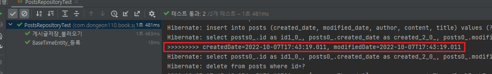

# JPA Auditing으로 생성시간_수정시간 자동화하기  

## JPA Auditing 사용 배경  

주로 엔티티에는 해당 데이터의 생성시간과 수정시간을 포함합니다.  
언제 만들어졌는지, 언제 수정되었는지 등은 차후 유지보수에 있어 굉장히 중요한 정보이기 때문입니다.  

그렇다 보니 매번 DB에 삽입하기 전, 갱신하기 전에 날짜 데이터를 등록/수정하는 코드가 여기저기 들어가게 됩니다.  

예시를 한번 들어보겠습니다.  
```java
// 생성일 추가 코드 예시
public void savePosts() {
    ...
    posts.setCreatedDate(new LocalDate());
    postsRepository.save(posts);
    ...
}
```  
이렇듯 단순하고 반복적인 코드가 모든 테이블과 서비스 메서드에 포함되어야 한다고 생각하면 귀찮고 코드도 지저분해집니다.  

그래서 이 문제를 해결하고자 JPA Auditing을 사용하겠습니다.  

## LocalDate 사용  

여기서부터는 날짜 타입을 사용합니다.  
Java8 부터 LocalDate와 LocalDateTime이 등장했습니다.  
그간 Java의 기본 날짜 타입인 Date의 문제점을 제대로 고친 타입이기에 Java8일 경우 무조건 써야한다고 생각하면 됩니다.  
- - - 
기존의 Date와 Calendar 클래스는 다음과 같은 문제점이 있었습니다.  
1. 불변 객체가 아닙니다.  
    - 멀티스레드 환경에서 언제든 문제가 발생할 수 있습니다.  
2. Calendar는 월(Month) 값 설계가 잘못되었습니다.  
    - 10월을 나타내는 Calendar.OCTOBER의 숫자 값은 '9'입니다.  

그래서 JodaTime이라는 오픈소스를 사용해서 문제점들을 피했었고, Java8이 되어선 LocalDate를 통해 해결했습니다.  
- - - 

domain 패키지에 BaseTimeEntity를 생성하겠습니다.  
```경로: com/dongeon110/book/springboot/domain/BaseTimeEntity.java```  
```java
import lombok.Getter;
import org.springframework.data.annotation.CreatedDate;
import org.springframework.data.annotation.LastModifiedDate;
import org.springframework.data.jpa.domain.support.AuditingEntityListener;

import javax.persistence.EntityListeners;
import javax.persistence.MappedSuperclass;
import java.time.LocalDateTime;

@Getter
@MappedSuperclass // 1.
@EntityListeners(AuditingEntityListener.class) // 2.
public abstract class BaseTimeEntity {
    @CreatedDate // 3.
    private LocalDateTime createdDate;

    @LastModifiedDate // 4.
    private LocalDateTime modifiedDate;
}
```
### 코드 설명  
1. ```@MappedSuperClass```  
    - JPA Entity 클래스들이 BaseTimeEntity를 상속할 경우 필드들(createdDate, modifiedDate)도 컬럼으로 인식하도록 합니다.  
2. ```@EntityListeners(AutitingEntityListener.class)```  
    - BaseTime Entity 클래스에 Auditing 기능을 포함시킵니다.  
3. ```@CreatedDate```
    - Entity가 생성되어 저장될 때 시간이 자동 저장 됩니다.  
4. ```@LastModifiedDate```  
    - 조회한 Entity의 값을 변경할 때 시간이 자동 저장됩니다.  

그리고 Posts 클래스가 BaseTimeEntity를 상속받도록 변경하겠습니다.  
```domain/posts/Posts.java```
```java
    ...
public class Posts extends BaseTimeEntity {
    ...
```

마지막으로 JPA Auditing 어노테이션을 모두 활성화할 수 있도록 Application 클래스에 활성화 어노테이션 하나를 추가하겠습니다.  
```Application.java```
```java
@EnableJpaAuditing // JPA Auditing 활성화
@SpringBootApplication
public class Application {
    public static void main(String[] args) {
        SpringApplication.run(Application.class, args);

    }
}
```

## JPA Auditing 테스트코드 작성하기  

PostsRepositoryTest 클래스에 테스트 메서드를 하나 추가하겠습니다.  
```test/../domain/posts/PostsRepositoryTest.java```  
```java
@Test
public void BaseTimeEntity_등록() {
    // given
    LocalDateTime now = LocalDateTime.of(2019,6,4,0,0,0);
    postsRepository.save(Posts.builder()
            .title("title")
            .content("content")
            .author("author")
            .build());

    // when
    List<Posts> postsList = postsRepository.findAll();

    // then
    Posts posts = postsList.get(0);

    System.out.println(">>>>>>>>> createdDate=" + posts.getCreatedDate()
            + ", modifiedDate=" + posts.getModifiedDate());

    assertThat(posts.getCreatedDate()).isAfter(now);
    assertThat(posts.getModifiedDate()).isAfter(now);
}
```

테스트 코드를 수행해보겠습니다.  
  
테스트가 정상적으로 통과했고 실제시간도 잘 저장된 것을 확인 할 수 있습니다.  

이제 더이상 등록일/수정일로 고민할 필요없이 BaseTimeEntity만 상속받으면 해결되었습니다.  

