- [PostgreSQL DB Lock](#postgresql-db-lock)
  - [0. Lock For Test.](#0-lock-for-test)
  - [1. Lock 확인](#1-lock-확인)
    - [1.1. Lock 정보 확인](#11-lock-정보-확인)
    - [1.2. Lock 때문에 다른 쿼리가 안되는 경우 확인.](#12-lock-때문에-다른-쿼리가-안되는-경우-확인)
  - [2. 원인 찾기](#2-원인-찾기)
    - [2.1. Lock 충돌 난 쿼리 확인](#21-lock-충돌-난-쿼리-확인)
    - [2.2. Lock 확인](#22-lock-확인)
    - [2.3. Lock 위치 확인](#23-lock-위치-확인)
    - [2.4. 다른 Lock 확인](#24-다른-lock-확인)
    - [2.5. 원인 쿼리 확인하기](#25-원인-쿼리-확인하기)

- - -
# PostgreSQL DB Lock
- DB 가 Lock 걸려서 충돌이 났을 때, 가장 먼저 찾아봐야 할 방법들.  
- pg_stat_activity, pg_locks, pg_class를 사용하자.  

## 0. Lock For Test.
- 직접 문제 상황을 가정하고 테스트를 하며 확인 해보자.

- 테스트를 위한 테이블 생성.
```sql
CREATE TABLE test_table (
	test_table_id bigserial PRIMARY KEY,
	test_column_a varchar(100)
);
```

- 각각 다른 곳에서 접속했다는 가정 하에, 알아보기 쉽게 구분해서 보자.
  - psql: 문제 발생! 락을 발생 시킨 곳!  
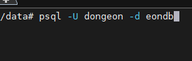
  - DBeaver: DB 상태를 확인하는 쿼리를 날려 볼 곳.  
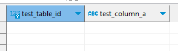
  - Intellij: 락과 충돌이 나는 쿼리를 날려볼 곳.  
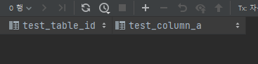


1. 테스트를 위해 일단 락을 걸자.
- DB에 아무 문제가 생기지 않을 가장 낮은 단계의 락을 걸자.
- 락을 발생시킨다. (psql에서)
```sql
BEGIN;
SELECT * FROM test_table;
```
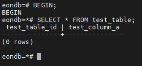
- BEGIN; 을 통해 트랜잭션을 시작 후, 조회 쿼리를 날리고, COMMIT 또는 ROLLBACK 하지 않는다.
- 가장 낮은 단계의 락이 걸리고 풀리지 않은 상태.

## 1. Lock 확인

### 1.1. Lock 정보 확인
1. 테이블 정보를 확인해보자
```sql
SELECT * FROM pg_locks;
```
- 전  
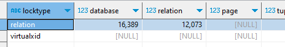
- 후  
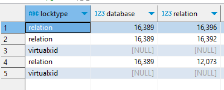

- 2개에서 5개로 늘어났다.
- 기존에 있는 건 정보를 확인하기 위한 쿼리.
- 추가된 3개의 쿼리가 이번에 생겨난 locks
- pg_locks.mode 컬럼에서 락 레벨을 알 수 있다.

2. 어떤 테이블에 걸린 건지 알아보자.
```sql
SELECT * FROM pg_class;
```
pg_locks.relation 과 pg_class.oid 로 조인하면 어떤 테이블인지 알 수 있다.
```sql
SELECT  c.relname,
		l.mode,
        l.relation, 
        l.virtualxid, 
        l.virtualtransaction,
        l.pid,
        l.waitstart
FROM pg_locks l
LEFT JOIN pg_class c
ON l.relation = c.oid;
```
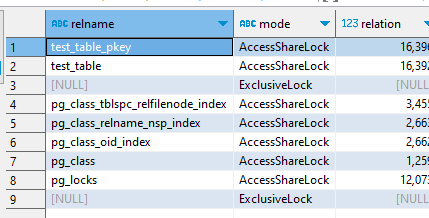
- 가장 먼저 봐야할 것은 c.relname, l.mode
- 내가 날린 조인 쿼리도 조회 레벨의 락이 걸리기 때문에 다 나옴.
- test_table에 AccessShareLock이 걸린 것을 확인.
- test_table_pkey에 걸린 락은 test_table의 Primary Key인데 옵티마이저가 내 SELECT 쿼리를 pk 인덱스로 조회했기 떄문이라고 생각.

1. Lock Level (mode 컬럼)
- 내가 테스트 하기 위해 임시로 건 Lock은, 테이블을 조회할 때 걸리는 
AccessShareLock 이다.  
- Postgres Lock Level에 대한 부분은 [공식문서](#https://www.postgresql.org/docs/current/explicit-locking.html)에서 확인 가능하다.
- 내가 조회한다고 다른 사람이 조회가 안되지는 않는다. (AccessShareLock 은 서로 충돌 하지 않기 때문에 문제가 없다.)
- 공식문서에서 표로 예쁘게 그려놨으니 확인해보자.  

### 1.2. Lock 때문에 다른 쿼리가 안되는 경우 확인.
- AccessShareLock와 충돌하는 테이블 락은 AccessExclusiveLock 하나.
  - AccessExclusiveLock은 테이블 DROP, ALTER 등 테이블을 바꿀 때 걸리는 락.

- 다른 곳에서 ALTER 쿼리를 날려서 AccessExclusiveLock 을 걸어보자.
- 락이 걸려있기 때문에 WAIT에 빠져 무한 로딩이 걸릴 것.

1. 조회 락과 충돌나는 쿼리 날리기
```sql
ALTER TABLE test_table ADD COLUMN test_column_b VARCHAR(100);
```
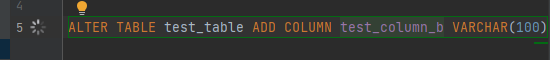
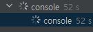

- 무한 로딩이 걸리며 WAIT 에 빠진 걸 알 수 있다.
2. ALTER TABLE 쿼리를 종료하지 않고 실행중인 쿼리 상태를 보자
```sql
SELECT * FROM pg_stat_activity; -- 볼 부분만 뽑아서 캡처했다.
```
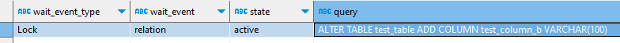

- wait_event_type 컬럼에 Lock이 걸려서 WAIT에 빠진 걸 알 수 있다.

## 2. 원인 찾기
- 실제상황이라면 왜 내가 날린 쿼리가 WAIT에 빠졌는지, 왜 LOCK이 걸리는 건지, 원인 쿼리를 찾아야 할 것이다.
- 물론 지금 테스트는 단순 SELECT 쿼리 트랜잭션이 종료되지 않은 이유겠지만 거꾸로 찾아가는 과정을 해보자.  

### 2.1. Lock 충돌 난 쿼리 확인
- 실행중인 쿼리 확인
```sql
SELECT * FROM pg_stat_activity;
```
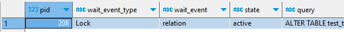
- wait_event_type이 Lock이 난 쿼리가 발생했다.

### 2.2. Lock 확인
- Lock 확인
```sql
SELECT * FROM pg_locks;
```
- 멈춘 쿼리 확인
```sql
SELECT a.pid, a.query, l.relation, l.virtualtransaction, l.mode
FROM pg_stat_activity a
LEFT JOIN pg_locks l 
ON a.pid = l.pid
WHERE a.wait_event_type = 'Lock';
```
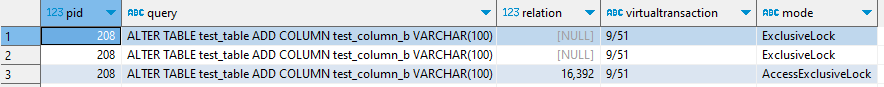
- pg_locks 에서 relation 에 어떤 테이블인지 확인하자.
- JOIN을 통해서 알 수도 있겠지만 기록을 위한곳에 조인 쿼리가 너무 길어지면 알아보기 힘들기 때문에 relation = 16392 인곳을 직접 검색하겠다.  

### 2.3. Lock 위치 확인
```sql
SELECT * FROM pg_class WHERE oid = 16392;
```
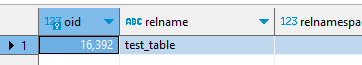
- test_table 에 Lock이 걸려있던 것을 확인 했다.

### 2.4. 다른 Lock 확인
- Lock이 걸린 테이블(oid=16392)에 다른 락이 걸려 있는지 확인한다.
```sql
SELECT relation, virtualtransaction, pid, mode
FROM pg_locks
WHERE relation = 16392;
```
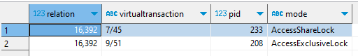

- [처음](#21-lock-충돌-난-쿼리-확인)에 충돌난 쿼리의 pid는 208이었다.
- 208이 아닌 233의 다른 Lock이 걸려 있는 걸 확인했다.

- AccessShareLock(조회) 과 AccessExclusiveLock(테이블 변경)은 공식문서에 나와있듯 충돌나는 락들이다.

### 2.5. 원인 쿼리 확인하기
```sql
SELECT *
FROM pg_stat_activity
WHERE pid = 233
```
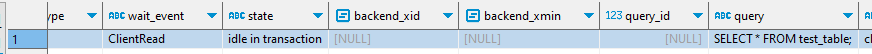

- 이제 각종 원인을 찾아야 한다.
- 원인은 아주 많을 것이라 쿼리부터 분석해보자.
- 여기서 원인은 state = 'idle in transaction'.
  - 트랜잭션 내에서 대기 상태.
- 날리던 쿼리를 확인하고 이상 없을 거같으면 kill 하던지 rollback 하던지 commit하던지 하자.

- psql 에 있던 쿼리를 죽였더니 대기하고 있던 테이블 수정 쿼리가 바로 적용 되었다.
