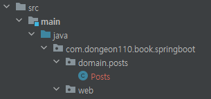

# 프로젝트에 Spring Data JPA 적용하기  

먼저, build.gradle에 다음과 같이 org.springframework:spring-boot-starter-data-jpa와 com.h2database:h2 의존성들을 등록합니다.  
```groovy
dependecies {
    implementation('org.springframework.boot:spring-boot-starter-web')
    implementation('org.projectlombok:lombok')
    implementation('org.springframework.boot:spring-boot-starter-data-jpa') // 1.
    implementation('com.h2database:h2') // 2. 
    testImplementation('org.springframework.boot:spring-boot-starter-test')
}
```

## 코드 설명  
1. spring-boot-starter-data-jpa  
- 스프링 부트용 Spring Data Jpa 추상화 라이브러리입니다.  
- 스프링 부트 버전에 맞춰 자동으로 JPA관련 라이브러리들의 버전을 관리해줍니다.  

2. h2  
- 인메모리 관계형 데이터베이스 입니다.  
- 별도의 설치가 필요 없이 프로젝트 의존성만으로 관리할 수 있습니다.  
- 메모리에서 실행되기 때문에 애플리케이션을 재시작할 때마다 초기화된다는 점을 이용하여 테스트 용도로 많이 사용됩니다.  
- 이 책에서는 JPA의 테스트, 로컬 환경에서의 구동에서 사용할 예정입니다.  

의존성 등록이 되었으면, 본격적으로 JPA 기능을 사용하기 위해서 다음과 같은 패키지를 만들겠습니다.  

## domain 패키지  

```com/dongeon110/book/springboot/domain```  
web 패키지와 같은 경로로 옆에 만들어줍니다.  

이 domain 패키지는 **도메인을 담을 패키지**입니다.  
여기서 도메인이란 게시글, 댓글, 회원, 정산, 결제 등 소프트웨어에 대한 요구사항 혹은 문제영역이라고 생각하면 됩니다.  

기존에 MyBatis 같은 쿼리 매퍼를 사용했다면 dao 패키지를 떠올릴 수 있지만, dao 패키지와는 조금 결이 다르다고 생각하면 됩니다.  
그간 xml에 쿼리를 담고, 클래스는 오로지 쿼리의 결과만 담던 일들이 모두 도메인클래스라고 불리는 곳에서 해결 됩니다.  

이 domain 패키지에 posts 패키지와 Posts클래스를 만듭니다.  


Posts 클래스의 코드는 다음과 같습니다.  
```Posts.java```
```java
import lombok.Builder;
import lombok.Getter;
import lombok.NoArgsConstructor;

import javax.persistence.Column;
import javax.persistence.Entity;
import javax.persistence.GeneratedValue;
import javax.persistence.GenerationType;
import javax.persistence.Id;

@Getter // 6.
@NoArgsConstructor // 5. 
@Entity // 1. 
public class Posts {

    @Id // 2.
    @GeneratedValue(strategy = GenerationType.IDENTITY) // 3. 
    private Long id;

    @Column(length = 500, nullable = false) // 4.
    private String title;

    @Column(columnDefinition = "TEXT", nullable = false)
    private String content;

    private String author;

    @Builder // 7.
    public Posts(String title, String content, String author) {
        this.title = title;
        this.content = content;
        this.author = author;
    }
}
```
- 어노에티션 순서  
    어노테이션 순서는 **주요 어노테이션을 클래스에 가깝게** 두는게 좋습니다.  
    이렇게 어노테이션을 정렬하는 기준은 다음과 같습니다.  

    @Entity는 JPA의 어노테이션이며,  
    @Getter, @NoArgsConstructor는 롬복의 어노테이션입니다.  
    
    롬복은 코드를 단순화시켜 주지만 필수 어노테이션은 아닙니다.  
    그러다 보니 주요 어노테이션인 @Entity를 클래스에 가깝게 두고, 롬복 어노테이션을 그 위로 두었습니다.  
    이렇게 하면 이후에 코틀린 등의 새 언어 전환으로 롬복이 더이상 필요 없을 경우 쉽게 삭제할 수 있습니다.  

Posts 클래스는 실제 DB 테이블과 매칭될 클래스이며, 보통 **Entity 클래스**라고도 합니다.  
JPA를 사용하시면 DB 데이터에 작업할 경우 실제 쿼리를 날리기보다는, 이 Entity 클래스의 수정을 통해 작업합니다.  

Posts 클래스에는 JPA에서 제공하는 어노테이션들이 몇 개 있습니다.  

## 코드 설명  
1. @Entity
- 테이블과 링크될 클래스임을 나타냅니다.  
- 기본값으로 클래스의 카멜케이스 이름을 언더스코어 네이밍(_)으로 테이블 이름을 매칭합니다.  
- ex) SalesManager.java → sales_manager table
2. @Id
- 해당 테이블의 PK 필드를 나타냅니다.  
3. @GeneratedValue
- PK의 생성 규칙을 나타냅니다.  
- 스프링 부트 2.0 에서는 GenerationType.IDENTITY 옵션을 추가해야만 auto_increment가 됩니다.  
- 스프링 부트 2.0과 1.5의 차이는 [해당링크](https://jojoldu.tistory.com/295)에 있으니 참고합니다.  
4. @Column
- 테이블의 칼럼을 나타내며 굳이 선언하지 않더라도 해당 클래스의 필드는 모두 칼럼이 됩니다.  
- 사용하는 이유는, 기본값 외에 추가로 변경이 필요한 옵션이 있으면 사용합니다.  
- 문자열의 경우 VARCHAR(255)가 기본값인데, 사이즈를 500으로 늘리고 싶거나 (ex:title), 타입을 TEXT로 변경하고 싶거나 (ex: content)등의 경우에 사용됩니다.  

5. @NoArgsContstructor
- 5~7 번은 롬복 라이브러리의 어노테이션입니다.  
- 기본 생성자 자동 추가  
- public Posts() {} 와 같은 효과

6. @Getter  
- 클래스 내 모든 필드의 Getter 메서드를 자동 생성

7. @Builder  
- 해당 클래스의 빌더 패턴 클래스를 생성
- 생성자 상단에 선언 시 생성자에 포함된 필드만 빌더에 포함

- - -
### 참고  
웬만하면 Entity의 PK는 Long타입의 Auto_increment를 추천합니다.  
주민등록번호와 같이 비즈니스상 유니크 키나, 여러키를 조합한 복합키로 PK를 잡을 경우 난감한 상황이 종종 발생합니다.  

1. FK를 맺을 때 다른 테이블에서 복합키 전부를 갖고 있거나, 중간 테이블을 하나 더 둬야하는 상황이 발생합니다. 
2. 인덱스에 좋은 영향을 끼치지 못합니다.  
3. 유니크한 조건이 변경될 경우 PK 전체를 수정해야 하는 일이 발생합니다.  

주민등록번호, 복합키 등은 유니크 키로 별도로 추가하시는 것을 추천드립니다.  
- - -

서비스 초기 구축 단계에선 테이블 설계(여기선 Entity 설계)가 빈번하게 변경되는데, 이때 롬복의 어노테이션들은 코드 변경량을 최소화시켜 주기 때문에 적극적으로 사용합니다.  

이 ```Posts```클래스에는 한가지 특이점이 있습니다.  
Setter 메서드가 없다는 점입니다.  

자바빈 규약을 생각하면서 getter/setter를 무작정 생성하는 경우가 있습니다.  
이렇게 되면 해당 클래스의 인스턴스 값들이 언제 어디서 변해야하는지 코드상으로 명확하게 구분할 수가 없어, 차후 기능 변경 시 정말 복잡해집니다.  

그래서 **Entity 클래스에서는 절대 Setter 메서드를 만들지 않습니다.**  
대신, 해당 필드의 값 변경이 필요하면 명확히 그 목적과 의도를 나타낼 수 있는 메서드를 추가해야만 합니다.  

예컨대, 주문 취소 메서드를 만든다고 가정하면 다음 코드로 비교해 보면 됩니다.  

```잘못된 사용 예```  
```java
public class Order {
    public void setStatus(boolean status) {
        this.status = status
    }
}

public void 주문서비스의_취소이벤트() {
    order.setStatus(false);
}
```

```올바른 사용 예```
```java
public class Order{
    public void cancelOrder() {
        this.status = false;
    }
}

public void 주문서비스의_취소이벤트 () {
    order.candelOrder();
}
```

그럼 Setter가 없는 상황에서 어떻게 값을 채워 DB에 삽입해야 할까요?  
기본적인 구조는 **생성자를 통해** 최종값을 채운 후 DB에 삽입하는 것이며, 값 변경이 필요한 경우 해당 이벤트에 맞는 public 메서드를 호출하여 변경하는 것을 전제로 합니다.  
이 책에서는 생성자 대신에 **@Builder를 통해 제공되는 빌더 클래스**를 사용합니다.  

예를 들어 다음과 같은 생성자가 있다면 개발자가 new Example(b, a) 처럼 a와 b의 위치를 변경해도 코드를 실행하기 전까지는 문제를 찾을 수가 없습니다.  
```java
public Example(String a, String b) {
    this.a = a;
    this.b = b;
}
```
하지만 빌더를 사용하게 되면 **어느 필드에 어떤 값을 채워야 할지 명확하게** 인지 할 수 있습니다. 
```java
Example.builder()
    .a(a)
    .b(b)
    .build();
```

Posts 클래스 생성 이후, Posts 클래스로 Database를 접근하게 해줄 JpaRepository를 생성합니다.  


```PostsRepository.java```
```java
import org.springframework.data.jpa.repository.JpaRepository;

public interface PostsRepository extends JpaRepository<Posts, Long> {
}
```

보통 MyBatis 등에서 Dao라고 불리는 DB Layer 접근자입니다.  
JPA에선 Repository라고 부르며 **인터페이스**로 생성합니다.  
단순히 인터페이스를 생성 후, JpaRepository\<Entity 클래스, PK 타입\>를 상속하면 기본적인 CRUD 메서드가 자동으로 생성됩니다.  

@Repository를 추가할 필요도 없습니다.  
여기서 주의할 점은 **Entity 클래스와 기본 Entity Repository는 함께 위치**해야 하는 점입니다.  
둘은 밀접한 관계이고, Entity클래스는 **기본 Entity Repository 없이는 제대로 역할을 할 수가 없습니다.**  

나중에 프로젝트 규모가 커져 도메인별로 프로젝트를 분리해야 한다면 이때 Entity 클래스와 기본 Repository는 함께 움직여야 하므로 **도메인 패키지에서 함께 관리**합니다.  

모두 작성한 후 간단하게 테스트 코드로 기능을 검증해 보겠습니다.  

