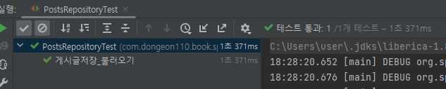
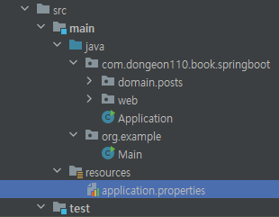
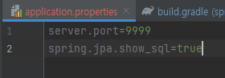
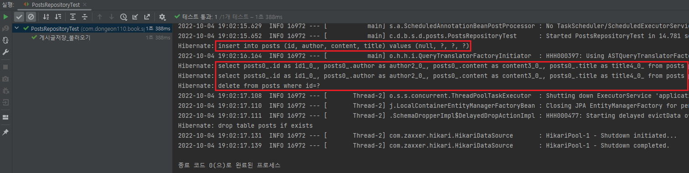

# Spring Data JPA 테스트 코드 작성하기  
[이전](./2.%20%ED%94%84%EB%A1%9C%EC%A0%9D%ED%8A%B8%EC%97%90%20Spring%20Data%20JPA%20%EC%A0%81%EC%9A%A9%ED%95%98%EA%B8%B0.md)에 작성한 부분을 테스트하기 위해 test 디렉토리에 domain.posts 패키지를 생성하고, 테스트 클래스는 ```PostsRepositoryTest```라는 이름으로 생성합니다.  


```PostsRepositoryTest```에서는 ```save```, ```findAll``` 기능을 테스트합니다.  

먼저, ```PostsRepositoryTest```에 아래 코드를 작성합니다.  
```java
import org.junit.After;
import org.junit.Test;
import org.junit.runner.RunWith;
import org.springframework.beans.factory.annotation.Autowired;
import org.springframework.boot.test.context.SpringBootTest;
import org.springframework.test.context.junit4.SpringRunner;

import java.util.List;

import static org.assertj.core.api.Assertions.assertThat;

@RunWith(SpringRunner.class)
@SpringBootTest
public class PostsRepositoryTest {

    @Autowired
    PostsRepository postsRepository;

    @After // 1.
    public void cleanup() {
        postsRepository.deleteAll();
    }

    @Test
    public void 게시글저장_불러오기() {
        // given
        String title = "테스트 게시글";
        String content = "테스트 본문";

        postsRepository.save(Posts.builder() // 2.
                .title(title)
                .content(content)
                .author("author@author.com")
                .build());

        // when
        List<Posts> postsList = postsRepository.findAll(); // 3.

        // then
        Posts posts = postsList.get(0);
        assertThat(posts.getTitle()).isEqualTo(title);
        assertThat(posts.getContent()).isEqualTo(content);
    }
}
```

## 코드 설명  
1. @After
- Junit에서 단위 테스트가 끝날 때마다 수행되는 메서드를 지정합니다.  
- 보통은 배포 전 전체 테스트를 수행할 때, 테스트간 데이터 침범을 막기 위해 사용합니다.  
- 여러 테스트가 동시에 수행되면 테스트용 데이터베이스인 H2에 데이터가 그대로 남아 있어 다음 테스트 실행 시 테스트가 실패할 수 있습니다.  

2. postsRepository.save  
- 테이블 posts에 insert/update 쿼리를 실행합니다.  
- id 값이 있다면 update가, 없다면 insert 쿼리가 실행됩니다.  

3. postsRepository.findAll
- 테이블 posts에 있는 모든 데이터를 조회해오는 메서드 입니다.  

별다른 설정 없이 @SpringBootTest를 사용할 경우 **H2 Database**를 자동으로 실행해 줍니다.  
이 테스트 역시 실행할 경우 H2가 자동으로 실행됩니다.  

그리고 테스트를 실행하였습니다.
  
테스트가 통과 되었습니다.  

과연 **실제로 실행된 쿼리는 어떤 형태일지** 실행된 쿼리를 로그로 볼 수 있습니다.  
Java 클래스로 구현할 수도 있으나, application.properties, application.yml 등의 파일로 한 줄의 코드로 설정할 수 있도록 지원하고 권장하기 때문에 이를 사용하겠습니다.  

```src/main/resources``` 디렉토리 아래에 ```application.properties``` 파일을 생성합니다.  
  
```application.properties```에 아래의 코드를 추가하고 다시 테스트를 수행합니다.  
- - -
```properties
spring.jpa.show_sql=true
```
  
- server.port 는 포트 에러로 인해 포트를 바꿔준 설정입니다.  
- - -
  
Hibernate가 작성한 쿼리를 콘솔 로그에서 확인 할 수 있었습니다.  

####